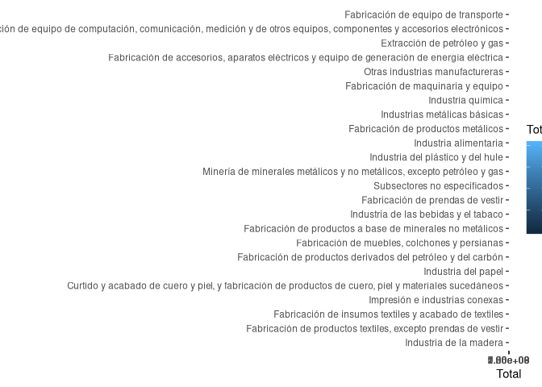
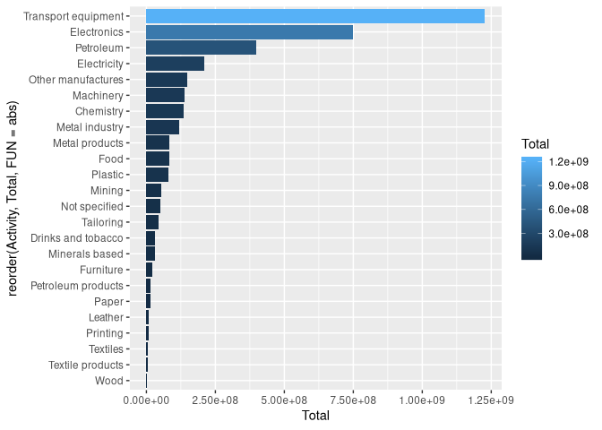
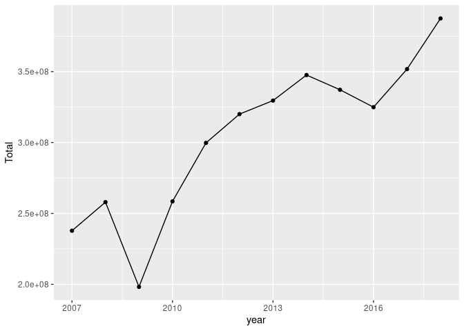
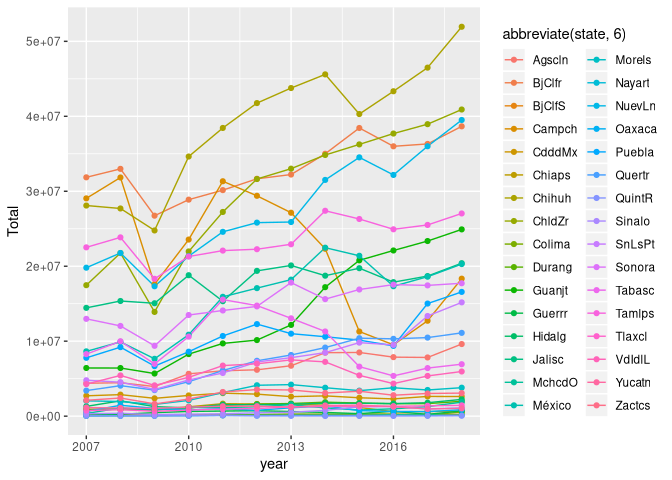
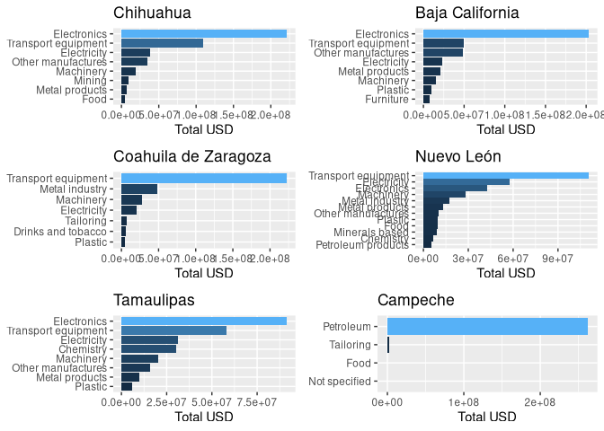
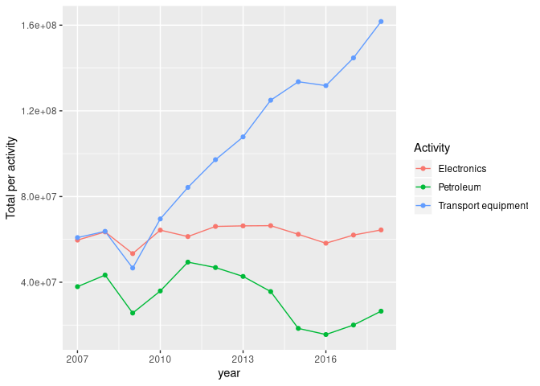
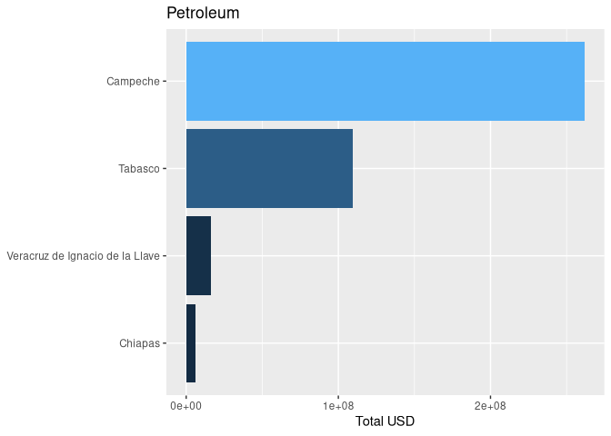
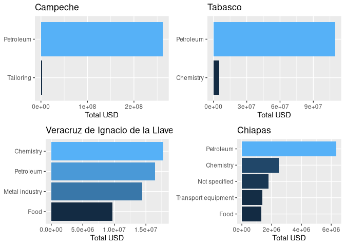

INTRODUCTION
============

The data set was taken from the website of the [national institute of
informatics.](https://www.inegi.org.mx/datos/) Downloaded in excel
format, it contains info about annual exportation of products by sector,
given in thousands of USD.


The excel file is separated in different sheets per state. Each sheet
contains the same information: annual exportation of products by sector,
given in thousands of USD, where each column contains information of the
year, from 2007 to 2017.

IMPORTING AND TIDYING THE DATA
==============================

Due to the format of the file, our first step will be to tidy up the
data in a format that is useful to R and more manageable by us.

``` r
  ## Calling libraries
  library(readxl)
  library(tidyverse)
  library(cowplot)

  ## Import from Excel

  ## The sheet names are the name of each state
  estados <- excel_sheets('ignore/EAEF_Entidad_Subsector.xlsx')
  ## Import column names and avoiding useless rows
  exportation <- read_xlsx('ignore/EAEF_Entidad_Subsector.xlsx',
                           range = "A5:N5", sheet = 1,
                           col_types = c("numeric", "text",
                                         rep("numeric", 12)))
  ## Create state column
  exportation <- mutate(exportation, state = "Aguascalientes")

  ## Iterate over every sheet
  for (i in 1:length(estados)){
      extracted <- read_xlsx('ignore/EAEF_Entidad_Subsector.xlsx',
                             range = "A7:N31", sheet = i,
                             col_names = F, na = "-",
                             col_types = c("numeric", "text",
                                           rep("numeric", 12)))
      colnames(extracted) <- colnames(exportation)[1:14]
      extracted <- mutate(extracted,
                          state = estados[i])
      exportation <- full_join(exportation, extracted)
  }

  ## Fix couple of column names
  colnames(exportation)[c(3, 14)] <- c("2007", "2018")
  exportation$`Código` <- parse_factor(as.character(exportation$`Código`))

  ## Tidying data
  export1 <- exportation %>%
      pivot_longer(cols = `2007`:`2018`,
                   names_to = "year",
                   values_to = "USD",
                   values_drop_na = T) %>%
      mutate(year = parse_double(year))

  export <- export1 %>%
      pivot_wider(names_from = "Descripción",
                  values_from = USD,
                  id_cols = c("state", "year"))

  ## Save our new data frames in a useful way
  write_csv(export1, "exportations_activity_rows.csv")
  write_csv(export, "exportations_activity_cols.csv")
```

Now we have 2 csv tables, `exportations_activity_rows.csv` (created from
`export1`) which keeps each activity as a row, and
`exportations_activity_cols` (from `export`) which transform each
activity into a column using `pivot_wider`. Each of the 2 can help us to
analyse the data in different ways. We decided to keep them as csv files
to make its access easier for GitHub users.

Exploratory Data Analysis (EDA)
===============================

Now if we start a new session, all we have to do is to call our
libraries and load the data from CSV:

``` r
library(tidyverse)
library(cowplot)

  export.rows <- read_csv("exportations_activity_rows.csv")
  export.cols <- read_csv("exportations_activity_cols.csv")
```

As the analysis developed, we found the importance of translating the
variable names to English. Not only for the reader to understand, but
also due to the long string and complexity of the categories in Spanish.
I could first translate and then save the csv files, however I
encountered this problem and fixed it once the csv files were already
created, and in honour to that, I decided to keep it in the same way for
this publication. Therefore, before diving into the EDA, here is the
code I used to translate the variables from Spanish (ES) to English
(EN).

``` r
## Spanish names in a vector
colnames(export.cols)
```

    ##  [1] "state"                                                                                                                 
    ##  [2] "year"                                                                                                                  
    ##  [3] "Exportaciones totales"                                                                                                 
    ##  [4] "Industria alimentaria"                                                                                                 
    ##  [5] "Industria de las bebidas y el tabaco"                                                                                  
    ##  [6] "Fabricación de insumos textiles y acabado de textiles"                                                                 
    ##  [7] "Fabricación de productos textiles, excepto prendas de vestir"                                                          
    ##  [8] "Fabricación de prendas de vestir"                                                                                      
    ##  [9] "Industria del papel"                                                                                                   
    ## [10] "Industria química"                                                                                                     
    ## [11] "Industria del plástico y del hule"                                                                                     
    ## [12] "Fabricación de productos a base de minerales no metálicos"                                                             
    ## [13] "Industrias metálicas básicas"                                                                                          
    ## [14] "Fabricación de productos metálicos"                                                                                    
    ## [15] "Fabricación de maquinaria y equipo"                                                                                    
    ## [16] "Fabricación de equipo de computación, comunicación, medición y de otros equipos, componentes y accesorios electrónicos"
    ## [17] "Fabricación de equipo de transporte"                                                                                   
    ## [18] "Fabricación de muebles, colchones y persianas"                                                                         
    ## [19] "Otras industrias manufactureras"                                                                                       
    ## [20] "Subsectores no especificados"                                                                                          
    ## [21] "Minería de minerales metálicos y no metálicos, excepto petróleo y gas"                                                 
    ## [22] "Curtido y acabado de cuero y piel, y fabricación de productos de cuero, piel y materiales sucedáneos"                  
    ## [23] "Industria de la madera"                                                                                                
    ## [24] "Impresión e industrias conexas"                                                                                        
    ## [25] "Fabricación de accesorios, aparatos eléctricos y equipo de generación de energía eléctrica"                            
    ## [26] "Extracción de petróleo y gas"                                                                                          
    ## [27] "Fabricación de productos derivados del petróleo y del carbón"

``` r
categorias <- colnames(export.cols)[3:27]

## Shorter equivalents in English
activities.en <- c("Total", "Food", "Drinks and tobacco",
                   "Textiles", "Textile products", "Tailoring",
                   "Paper", "Chemistry", "Plastic",
                   "Minerals based", "Metal industry", "Metal products",
                   "Machinery", "Electronics", "Transport equipment",
                   "Furniture", "Other manufactures", "Not specified",
                   "Mining", "Leather", "Wood",
                   "Printing", "Electricity", "Petroleum",
                   "Petroleum products")

## Change column names
colnames(export.cols)[3:27] <- activities.en
```

To change the values in `export.rows` we will need to convert the
Spanish expressions into English ones. Here functional programming comes
very handy: first we create our function `translate`, which will do the
final job, and then we fill the gaps, in this case, we create
`equivalent`, which will find the equivalent expression in each
language. However, `equivalent` must be run before `translate` to work.

``` r
translate <- function(vector.es){
    vector.en <- c()
    for (i in 1:length(vector.es)){
        expression.es <- vector.es[i]
        expression.en <- equivalent(expression.es)
        ## Here "equivalent" should take expression.es and return the
        ## equivalent in English
        vector.en <- append(vector.en, expression.en)
    }
    vector.en
}

equivalent <- function(expression.es){
    position <- match(expression.es, categorias)
    expression.en <- activities.en[position]
    expression.en
}

## Testing our new functions
equivalent("Impresión e industrias conexas")
```

    ## [1] "Printing"

``` r
translate(categorias)
```

    ##  [1] "Total"               "Food"                "Drinks and tobacco" 
    ##  [4] "Textiles"            "Textile products"    "Tailoring"          
    ##  [7] "Paper"               "Chemistry"           "Plastic"            
    ## [10] "Minerals based"      "Metal industry"      "Metal products"     
    ## [13] "Machinery"           "Electronics"         "Transport equipment"
    ## [16] "Furniture"           "Other manufactures"  "Not specified"      
    ## [19] "Mining"              "Leather"             "Wood"               
    ## [22] "Printing"            "Electricity"         "Petroleum"          
    ## [25] "Petroleum products"

``` r
## Creating a new column "Activity" with the English expressions
export.rows <- mutate(export.rows,
                      Activity = translate(`Descripción`))
```

Now to start with the EDA, let’s look at the totals by state, using
`export.cols`

``` r
  export.cols %>%
    group_by(state) %>%
    summarise(`total export` = sum(Total)) %>%
    arrange(desc(`total export`)) %>%
    print(n = Inf)
```

    ## # A tibble: 32 x 2
    ##    state                           `total export`
    ##    <chr>                                    <dbl>
    ##  1 Chihuahua                            466861927
    ##  2 Baja California                      398935507
    ##  3 Coahuila de Zaragoza                 355638907
    ##  4 Nuevo León                           330267052
    ##  5 Tamaulipas                           284435973
    ##  6 Campeche                             264100465
    ##  7 Jalisco                              213931233
    ##  8 México                               188357470
    ##  9 Sonora                               179661021
    ## 10 Guanajuato                           167191962
    ## 11 Puebla                               127934390
    ## 12 Tabasco                              115797563
    ## 13 San Luis Potosí                       94812554
    ## 14 Querétaro                             88633615
    ## 15 Aguascalientes                        79688240
    ## 16 Veracruz de Ignacio de la Llave       68556313
    ## 17 Morelos                               37397175
    ## 18 Zacatecas                             34010223
    ## 19 Ciudad de México                      32037661
    ## 20 Hidalgo                               19504479
    ## 21 Durango                               17431796
    ## 22 Yucatán                               14496875
    ## 23 Michoacán de Ocampo                   13411397
    ## 24 Chiapas                               13291536
    ## 25 Tlaxcala                              12987607
    ## 26 Oaxaca                                11023551
    ## 27 Sinaloa                                7825439
    ## 28 Guerrero                               5918438
    ## 29 Colima                                 2518028
    ## 30 Baja California Sur                    2303491
    ## 31 Nayarit                                1146388
    ## 32 Quinta Roo                              517674

``` r
   ## Graphical mode
  export.cols %>%
      group_by(state) %>%
      summarise(`total export` = sum(Total)) %>%
      ggplot() +
      geom_bar(aes(y = `total export`,
                   x = reorder(state, `total export`, FUN = abs),
                   fill = `total export`),
               stat = 'identity') +
      coord_flip()
```



Now, to do the same but by category, we could simply use `export.rows`

``` r
export.rows %>%
    filter(Activity != "Total") %>%
    group_by(Activity) %>%
    summarise(Total = sum(USD)) %>%
    arrange(desc(Total)) %>%
    print(n = Inf)
```

    ## # A tibble: 24 x 2
    ##    Activity                 Total
    ##    <chr>                    <dbl>
    ##  1 Transport equipment 1226859499
    ##  2 Electronics          747959073
    ##  3 Petroleum            397933968
    ##  4 Electricity          208582754
    ##  5 Other manufactures   147915402
    ##  6 Machinery            136957553
    ##  7 Chemistry            133570853
    ##  8 Metal industry       117915995
    ##  9 Metal products        82889135
    ## 10 Food                  81653585
    ## 11 Plastic               80126816
    ## 12 Mining                52953993
    ## 13 Not specified         51470567
    ## 14 Tailoring             43913959
    ## 15 Drinks and tobacco    31059501
    ## 16 Minerals based        30584505
    ## 17 Furniture             19883596
    ## 18 Petroleum products    14565067
    ## 19 Paper                 13876523
    ## 20 Leather                9863853
    ## 21 Printing               6915538
    ## 22 Textiles               6260722
    ## 23 Textile products       4954252
    ## 24 Wood                   1959275

``` r
export.rows %>%
    filter(Activity != "Total") %>%
    group_by(Activity) %>%
    summarise(Total = sum(USD)) %>%
    ggplot() +
    geom_bar(aes(y = Total,
                 x = reorder(Activity, Total, FUN = abs),
                 fill = Total),
             stat = 'identity') +
    coord_flip()
```



Finally, total exportations per year:

``` r
export.cols %>%
    group_by(year) %>%
    summarise(`total export` = sum(Total)) %>%
    print(n = Inf)
```

    ## # A tibble: 12 x 2
    ##     year `total export`
    ##    <dbl>          <dbl>
    ##  1  2007      237809741
    ##  2  2008      257967777
    ##  3  2009      198234125
    ##  4  2010      258504747
    ##  5  2011      299732519
    ##  6  2012      320014188
    ##  7  2013      329562705
    ##  8  2014      347559680
    ##  9  2015      337170197
    ## 10  2016      324901419
    ## 11  2017      351726063
    ## 12  2018      387442789

``` r
## Visualisation
export.rows %>%
    filter(Activity == "Total") %>%
    group_by(year) %>%
    summarise(Total = sum(USD)) %>%
    ggplot(aes(x = year, y = Total)) +
    geom_line() +
    geom_point() 
```



``` r
## Per state
export.rows %>%
    filter(Activity == "Total") %>%
    group_by(year, state) %>%
    summarise(Total = sum(USD)) %>%
    ggplot(aes(x = year, y = Total)) +
    geom_line(aes(colour = abbreviate(state, 6)))+
    geom_point(aes(colour = abbreviate(state, 6)))
```



We also would like to see if every year was the same state and/or the
same activity making the biggest money by exportation, or if this
changed with the time. Unfortunately, our figure with the total
exportation per year grouped by state is quite messy and difficult to
appreciate due to the big number of states. Thus we need a different
approach to that

``` r
## Main state per year
export.cols %>%
    group_by(year) %>%
    filter(Total == max(Total)) %>%
    select(year, state, Total) %>%
    arrange(year)
```

    ## # A tibble: 12 x 3
    ## # Groups:   year [12]
    ##     year state              Total
    ##    <dbl> <chr>              <dbl>
    ##  1  2007 Baja California 31858677
    ##  2  2008 Baja California 32988913
    ##  3  2009 Baja California 26741828
    ##  4  2010 Chihuahua       34633881
    ##  5  2011 Chihuahua       38446014
    ##  6  2012 Chihuahua       41764861
    ##  7  2013 Chihuahua       43770979
    ##  8  2014 Chihuahua       45594451
    ##  9  2015 Chihuahua       40302945
    ## 10  2016 Chihuahua       43342067
    ## 11  2017 Chihuahua       46491551
    ## 12  2018 Chihuahua       51944047

``` r
## Activity
export.rows %>%
    filter(Activity != "Total") %>%
    group_by(year) %>%
    filter(USD == max(USD)) %>%
    arrange(year) %>%
    select(Activity, state, year)
```

    ## # A tibble: 12 x 3
    ## # Groups:   year [12]
    ##    Activity            state                 year
    ##    <chr>               <chr>                <dbl>
    ##  1 Petroleum           Campeche              2007
    ##  2 Petroleum           Campeche              2008
    ##  3 Petroleum           Campeche              2009
    ##  4 Petroleum           Campeche              2010
    ##  5 Petroleum           Campeche              2011
    ##  6 Petroleum           Campeche              2012
    ##  7 Petroleum           Campeche              2013
    ##  8 Transport equipment Coahuila de Zaragoza  2014
    ##  9 Transport equipment Coahuila de Zaragoza  2015
    ## 10 Transport equipment Coahuila de Zaragoza  2016
    ## 11 Transport equipment Coahuila de Zaragoza  2017
    ## 12 Transport equipment Coahuila de Zaragoza  2018

Our results are quite interesting: the main state until 2009 is *Baja
California*, and then it changes to *Chihuahua*, but when we look at the
main activity exporting USD, the main states are *Campeche* until 2013
and then it changes to *Coahuila*. It seems that there is not a big
difference between activities in the total USD produced by exportation,
and that different combinations could lead to a bigger production in a
single state. A good example of this is *Campeche*, who is the leader in
the main exportation activity from 2007 to 2013, however it goes to the
6Th position when it comes to the total exportations overall.

It could be interesting to look at the main states exporting, as well as
the leading activities.

Interactive visualisation
=========================

We can create specific functions using our data frames to look directly
at a given state or activity in order to make our analysis easier and
find specific patterns.

``` r
## FUNCTION TO CHOOSE MAIN ACTIVITY PER STATE
plot_state <- function(estado, USD_min = 5000000){
    export.rows %>%
        filter(Activity != "Total") %>%
        group_by(state, Activity)  %>%
        summarise(Total = sum(USD)) %>%
        filter(state == estado &
               Total >= USD_min) %>%
        ggplot() +
        geom_bar(aes(y = Total,
                     x = reorder(Activity, Total, FUN = abs),
                     fill = Total),
                 stat = 'identity') +
        coord_flip() +
        labs(title = estado,
             y = "Total USD", x = NULL) +
        theme(legend.position="none")
}

## FUNCTION TO CHOOSE MAIN STATES IN A GIVEN ACTIVITY
plot_activity <- function(activity, USD_min = 5000000){
    export.cols %>%
        select(state, year, activity) %>%
        group_by(state)  %>%
        summarise(Total = sum(!!sym(activity))) %>%
        filter(Total >= USD_min) %>%
        ggplot() +
        geom_bar(aes(y = Total,
                     x = reorder(state,
                                 Total, FUN = abs),
                     fill = Total),
                 stat = 'identity') +
        coord_flip() +
        labs(title = activity,
             y = "Total USD", x = NULL) +
        theme(legend.position="none")
}
```

Now we can see particular states and activities. We can start with the
main 6 states to see why are there differences in the main activities
and main states exporting.

``` r
plot_grid(
    plot_state("Chihuahua") ,
    plot_state("Baja California"),
    plot_state("Coahuila de Zaragoza"),
    plot_state("Nuevo León"),
    plot_state("Tamaulipas"),
    plot_state("Campeche", USD_min = 10000),
    ncol = 2)
```



Despite of the fact that different states get their main exportation
from different products, *Electronics* and *Transport equipment* are
generally in the first 2 places. Other activities such as *Machinery*
and *Metal products* also remain in the top exportations among the first
5 states. In other words, there is a trend among the 5 states with the
biggest exportation income with the kind of activities that are
responsible for it. However, this trend is totally broken in the case of
*Campeche*, which is on the 6Th place and main exportation activity is
from *Petroleum*, which no other state in the top 5 shares.
Nevertheless, petroleum or, *Extraction of petroleum and oil* as it
translates, is in the third position of main activities responsible for
exportations.

``` r
export.rows %>%
    filter(Activity == "Electronics" |
           Activity == "Transport equipment" |
           Activity == "Petroleum") %>%
    group_by(year, Activity) %>%
    summarise(`Total per activity` = sum(USD)) %>%
    ggplot(aes(x = year, y = `Total per activity`)) +
    geom_line(aes(colour = Activity)) +
    geom_point(aes(colour = Activity))
```

 It looks
like the extraction of petroleum and oil has, at least since 2007, been
exporting less than the production of electronics and transport
equipment. And another interesting trend is observed in the last plot:
since 2009, the production of transport equipment had a considerable
increase in its exportations.

Coming back to petroleum extraction, we can have a look at the top
petroleum exporters using our `plot_activity` function

``` r
plot_activity("Petroleum")
```



Only 4 states are exporting more than 5,000 million USD from petroleum.

``` r
plot_grid(
    plot_state("Campeche", USD_min = 1000000),
    plot_state("Tabasco", USD_min = 1000000),
    plot_state("Veracruz de Ignacio de la Llave"),
    plot_state("Chiapas", USD_min = 1000000))
```



It seems that the economy of Tabasco, Campeche and Chiapas depends in a
big extent on the extraction of petroleum, unlike Veracruz which has
other strong activities such as Chemistry, Metalurgical and Food
industries.
