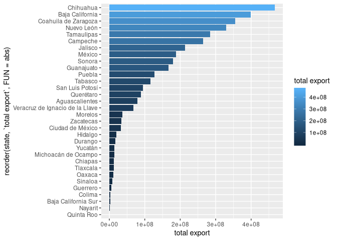
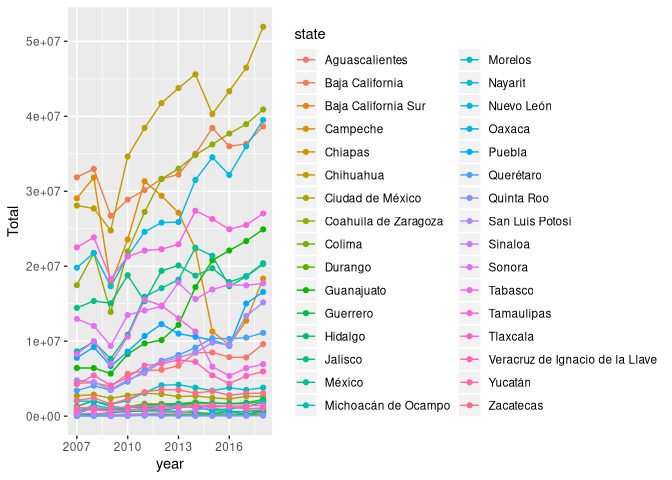

INTRODUCTION
============

The data set was taken from the website of the national institute of
informatics. Downloaded in excel format, it contains info about annual
exportation of products by sector, given in thousands of USD.

IMPORTING AND TIDYING THE DATA
==============================

The excel file is separated in different sheets per state. Each sheet
contains the same information: annual exportation of products by sector,
given in thousands of USD, where each column contains information of the
year, from 2007 to 2017.

Our first step will be to import the data from the excel file, and
tidying it in a useful way:

``` r
  ## Calling libraries
  library(readxl)
  library(tidyverse)

  ## Import from Excel

  ## The sheet names are the name of each state
  estados <- excel_sheets('ignore/EAEF_Entidad_Subsector.xlsx')
  ## Import column names and avoiding useless rows
  exportation <- read_xlsx('ignore/EAEF_Entidad_Subsector.xlsx',
                           range = "A5:N5", sheet = 1,
                           col_types = c("numeric", "text",
                                         rep("numeric", 12)))
  ## Create state column
  exportation <- mutate(exportation, state = "Aguascalientes")

  ## Iterate over every sheet
  for (i in 1:length(estados)){
      extracted <- read_xlsx('ignore/EAEF_Entidad_Subsector.xlsx',
                             range = "A7:N31", sheet = i,
                             col_names = F, na = "-",
                             col_types = c("numeric", "text",
                                           rep("numeric", 12)))
      colnames(extracted) <- colnames(exportation)[1:14]
      extracted <- mutate(extracted,
                          state = estados[i])
      exportation <- full_join(exportation, extracted)
  }

  ## Fix couple of column names
  colnames(exportation)[c(3, 14)] <- c("2007", "2018")
  exportation$`Código` <- parse_factor(as.character(exportation$`Código`))

  ## Tidying data

  export1 <- exportation %>%
      pivot_longer(cols = `2007`:`2018`,
                   names_to = "year",
                   values_to = "USD",
                   values_drop_na = T) %>%
      mutate(year = parse_double(year))
  export <- export1 %>%
      pivot_wider(names_from = "Descripción",
                  values_from = USD,
                  id_cols = c("state", "year"))

  ## Save our new data frames in a useful way
  write_csv(export1, "exportations_activity_rows.csv")
  write_csv(export, "exportations_activity_cols.csv")
```

Now we have 2 csv tables, `exportations_activity_rows.csv` (created from
`export1`) which keeps each activity as a row, and
`exportations_activity_cols` (from `export`) which transform each
activity into a column using `pivot_wider`. Each of the 2 can help us to
analyse the data in different ways. We decided to keep them as csv files
to make its access easier for github users.

Exploratory Data Analysis (EDA)
===============================

Now if we start a new session, all we have to do is to call our
libraries and load the data from CSV:

``` r
  library(tidyverse)

  export.rows <- read_csv("exportations_activity_rows.csv")
  export.cols <- read_csv("exportations_activity_cols.csv")
```

Due to the complexity in the variables names, we are going to storage
them into an object to facilitate its accesibility. We could also rename
them, but this would reduce its descriptive nature.

``` r
  categorias <- colnames(export.cols)[3:27]
  categorias
```

    ##  [1] "Exportaciones totales"                                                                                                 
    ##  [2] "Industria alimentaria"                                                                                                 
    ##  [3] "Industria de las bebidas y el tabaco"                                                                                  
    ##  [4] "Fabricación de insumos textiles y acabado de textiles"                                                                 
    ##  [5] "Fabricación de productos textiles, excepto prendas de vestir"                                                          
    ##  [6] "Fabricación de prendas de vestir"                                                                                      
    ##  [7] "Industria del papel"                                                                                                   
    ##  [8] "Industria química"                                                                                                     
    ##  [9] "Industria del plástico y del hule"                                                                                     
    ## [10] "Fabricación de productos a base de minerales no metálicos"                                                             
    ## [11] "Industrias metálicas básicas"                                                                                          
    ## [12] "Fabricación de productos metálicos"                                                                                    
    ## [13] "Fabricación de maquinaria y equipo"                                                                                    
    ## [14] "Fabricación de equipo de computación, comunicación, medición y de otros equipos, componentes y accesorios electrónicos"
    ## [15] "Fabricación de equipo de transporte"                                                                                   
    ## [16] "Fabricación de muebles, colchones y persianas"                                                                         
    ## [17] "Otras industrias manufactureras"                                                                                       
    ## [18] "Subsectores no especificados"                                                                                          
    ## [19] "Minería de minerales metálicos y no metálicos, excepto petróleo y gas"                                                 
    ## [20] "Curtido y acabado de cuero y piel, y fabricación de productos de cuero, piel y materiales sucedáneos"                  
    ## [21] "Industria de la madera"                                                                                                
    ## [22] "Impresión e industrias conexas"                                                                                        
    ## [23] "Fabricación de accesorios, aparatos eléctricos y equipo de generación de energía eléctrica"                            
    ## [24] "Extracción de petróleo y gas"                                                                                          
    ## [25] "Fabricación de productos derivados del petróleo y del carbón"

Let’s look at the totals by state, using `export.cols`

``` r
  export.cols %>%
      group_by(state) %>%
      summarise(`total export` = sum(!!sym(categorias[1]))) %>%
      arrange(desc(`total export`)) %>%
      print(n = Inf)
```

    ## # A tibble: 32 x 2
    ##    state                           `total export`
    ##    <chr>                                    <dbl>
    ##  1 Chihuahua                            466861927
    ##  2 Baja California                      398935507
    ##  3 Coahuila de Zaragoza                 355638907
    ##  4 Nuevo León                           330267052
    ##  5 Tamaulipas                           284435973
    ##  6 Campeche                             264100465
    ##  7 Jalisco                              213931233
    ##  8 México                               188357470
    ##  9 Sonora                               179661021
    ## 10 Guanajuato                           167191962
    ## 11 Puebla                               127934390
    ## 12 Tabasco                              115797563
    ## 13 San Luis Potosí                       94812554
    ## 14 Querétaro                             88633615
    ## 15 Aguascalientes                        79688240
    ## 16 Veracruz de Ignacio de la Llave       68556313
    ## 17 Morelos                               37397175
    ## 18 Zacatecas                             34010223
    ## 19 Ciudad de México                      32037661
    ## 20 Hidalgo                               19504479
    ## 21 Durango                               17431796
    ## 22 Yucatán                               14496875
    ## 23 Michoacán de Ocampo                   13411397
    ## 24 Chiapas                               13291536
    ## 25 Tlaxcala                              12987607
    ## 26 Oaxaca                                11023551
    ## 27 Sinaloa                                7825439
    ## 28 Guerrero                               5918438
    ## 29 Colima                                 2518028
    ## 30 Baja California Sur                    2303491
    ## 31 Nayarit                                1146388
    ## 32 Quinta Roo                              517674

``` r
   ## Graphical mode
  export.cols %>%
      group_by(state) %>%
      summarise(`total export` = sum(!!sym(categorias[1]))) %>%
      ggplot() +
      geom_bar(aes(y = `total export`,
                   x = reorder(state, `total export`, FUN = abs),
                   fill = `total export`),
               stat = 'identity') +
      coord_flip()
```



Now, to do the same but by category, we could simply use `export.rows`

``` r
  export.rows %>%
      filter(`Descripción` != categorias[1]) %>%
      group_by(`Descripción`) %>%
      summarise(Total = sum(USD)) %>%
      arrange(desc(Total)) %>%
      print(n = Inf)
```

    ## # A tibble: 24 x 2
    ##    Descripción                                                        Total
    ##    <chr>                                                              <dbl>
    ##  1 Fabricación de equipo de transporte                               1.23e9
    ##  2 Fabricación de equipo de computación, comunicación, medición …    7.48e8
    ##  3 Extracción de petróleo y gas                                      3.98e8
    ##  4 Fabricación de accesorios, aparatos eléctricos y equipo de ge…    2.09e8
    ##  5 Otras industrias manufactureras                                   1.48e8
    ##  6 Fabricación de maquinaria y equipo                                1.37e8
    ##  7 Industria química                                                 1.34e8
    ##  8 Industrias metálicas básicas                                      1.18e8
    ##  9 Fabricación de productos metálicos                                8.29e7
    ## 10 Industria alimentaria                                             8.17e7
    ## 11 Industria del plástico y del hule                                 8.01e7
    ## 12 Minería de minerales metálicos y no metálicos, excepto petról…    5.30e7
    ## 13 Subsectores no especificados                                      5.15e7
    ## 14 Fabricación de prendas de vestir                                  4.39e7
    ## 15 Industria de las bebidas y el tabaco                              3.11e7
    ## 16 Fabricación de productos a base de minerales no metálicos         3.06e7
    ## 17 Fabricación de muebles, colchones y persianas                     1.99e7
    ## 18 Fabricación de productos derivados del petróleo y del carbón      1.46e7
    ## 19 Industria del papel                                               1.39e7
    ## 20 Curtido y acabado de cuero y piel, y fabricación de productos…    9.86e6
    ## 21 Impresión e industrias conexas                                    6.92e6
    ## 22 Fabricación de insumos textiles y acabado de textiles             6.26e6
    ## 23 Fabricación de productos textiles, excepto prendas de vestir      4.95e6
    ## 24 Industria de la madera                                            1.96e6

``` r
  export.rows %>%
      filter(`Descripción` != categorias[1]) %>%
      group_by(`Descripción`) %>%
      summarise(Total = sum(USD)) %>%
      ggplot() +
      geom_bar(aes(y = Total,
                   x = reorder(`Descripción`, Total, FUN = abs),
                   fill = Total),
               stat = 'identity') +
      coord_flip()
```


Finally, total exportations per year:

``` r
  export.cols %>%
      group_by(year) %>%
      summarise(`total export` = sum(!!sym(categorias[1]))) %>%
      print(n = Inf)
```

    ## # A tibble: 12 x 2
    ##     year `total export`
    ##    <dbl>          <dbl>
    ##  1  2007      237809741
    ##  2  2008      257967777
    ##  3  2009      198234125
    ##  4  2010      258504747
    ##  5  2011      299732519
    ##  6  2012      320014188
    ##  7  2013      329562705
    ##  8  2014      347559680
    ##  9  2015      337170197
    ## 10  2016      324901419
    ## 11  2017      351726063
    ## 12  2018      387442789

``` r
   ## Visualization
  export.rows %>%
      filter(`Descripción` != categorias[1]) %>%
      group_by(year) %>%
      summarise(Total = sum(USD)) %>%
      ggplot(aes(x = year, y = Total)) +
      geom_line() +
      geom_point() 
```


``` r
   ## Per state
  export.rows %>%
      filter(`Descripción` != categorias[1]) %>%
      group_by(year, state) %>%
      summarise(Total = sum(USD)) %>%
      ggplot(aes(x = year, y = Total)) +
      geom_line(aes(colour = state))+
      geom_point(aes(colour = state))
```



We also would like to see if every year was the same state and/or the
same activity making the biggest money by exportation, or if this
changed with the time. Unfortunately, our figure with the total
exportation per year grouped by state is quite messy and dificult to
appreciate due to the big number of states. Thus we need a different
approach to that

``` r
## Main state per year
export.cols %>%
    group_by(year) %>%
    filter(!!sym(categorias[1]) == max(!!sym(categorias[1]))) %>%
    select(year, state, !!sym(categorias[1])) %>%
    arrange(year)
```

    ## # A tibble: 12 x 3
    ## # Groups:   year [12]
    ##     year state           `Exportaciones totales`
    ##    <dbl> <chr>                             <dbl>
    ##  1  2007 Baja California                31858677
    ##  2  2008 Baja California                32988913
    ##  3  2009 Baja California                26741828
    ##  4  2010 Chihuahua                      34633881
    ##  5  2011 Chihuahua                      38446014
    ##  6  2012 Chihuahua                      41764861
    ##  7  2013 Chihuahua                      43770979
    ##  8  2014 Chihuahua                      45594451
    ##  9  2015 Chihuahua                      40302945
    ## 10  2016 Chihuahua                      43342067
    ## 11  2017 Chihuahua                      46491551
    ## 12  2018 Chihuahua                      51944047

``` r
## Activity
export.rows %>%
    filter(`Descripción` != categorias[1]) %>%
    group_by(year) %>%
    filter(USD == max(USD)) %>%
    arrange(year)
```

    ## # A tibble: 12 x 5
    ## # Groups:   year [12]
    ##    Código Descripción                      state               year     USD
    ##     <dbl> <chr>                            <chr>              <dbl>   <dbl>
    ##  1    211 Extracción de petróleo y gas     Campeche            2007  2.88e7
    ##  2    211 Extracción de petróleo y gas     Campeche            2008  3.16e7
    ##  3    211 Extracción de petróleo y gas     Campeche            2009  1.74e7
    ##  4    211 Extracción de petróleo y gas     Campeche            2010  2.33e7
    ##  5    211 Extracción de petróleo y gas     Campeche            2011  3.11e7
    ##  6    211 Extracción de petróleo y gas     Campeche            2012  2.92e7
    ##  7    211 Extracción de petróleo y gas     Campeche            2013  2.69e7
    ##  8    336 Fabricación de equipo de transp… Coahuila de Zarag…  2014  2.32e7
    ##  9    336 Fabricación de equipo de transp… Coahuila de Zarag…  2015  2.43e7
    ## 10    336 Fabricación de equipo de transp… Coahuila de Zarag…  2016  2.56e7
    ## 11    336 Fabricación de equipo de transp… Coahuila de Zarag…  2017  2.52e7
    ## 12    336 Fabricación de equipo de transp… Coahuila de Zarag…  2018  2.62e7

Our results are quite interesting: the main state until 2009 is *Baja
California*, and then it changes to *Chihuahua*, but when we look at the
main activity exporting USD, the main states are *Campeche* until 2013
and then it changes to *Coahuila*. It seems that there is not a big
difference between activities in the total USD produced by exportation,
and that different combinations could lead to a bigger production in a
single state. A good example of this is *Campeche*, who is the leader in
the main exportation activity from 2007 to 2013, however it goes to the
6th position when it comes to the total exportations overall.

It could be interesting to look at the main states exporting, as well as
the leading activities.

Interactive visualization
=========================

We can create specific functions using our data frames to look directly
at a given state or activity in order to make our analysis easier and
find specific patterns.

``` r
## FUNCTION TO CHOSEE MAIN ACTIVITY PER STATE
plot_state <- function(estado, USD_min = 5000000){
    export.rows %>%
        filter(`Descripción` != "Exportaciones totales") %>%
        group_by(state, `Descripción`)  %>%
        summarise(Total = sum(USD)) %>%
        filter(state == estado &
               Total >= USD_min) %>%
        ggplot() +
        geom_bar(aes(y = Total,
                     x = reorder(`Descripción`, Total, FUN = abs),
                     fill = Total),
                 stat = 'identity') +
        coord_flip() +
        labs(title = estado,
             y = "Total USD", x = NULL) +
        theme(legend.position="none")
}

## FUNCTION TO CHOSEE MAIN STATES IN A GIVEN ACTIVITY
plot_activity <- function(activity_id, USD_min = 5000000){
    activity <- colnames(export.cols)[3:27]
    export.cols %>%
        select(state, year, activity[activity_id]) %>%
        group_by(state)  %>%
        summarise(Total = sum(!!sym(activity[activity_id]))) %>%
        filter(Total >= USD_min) %>%
        ggplot() +
        geom_bar(aes(y = Total,
                     x = reorder(state,
                                 Total, FUN = abs),
                     fill = Total),
                 stat = 'identity') +
        coord_flip() +
        labs(title = activity[activity_id],
             y = "Total USD", x = NULL) +
        theme(legend.position="none")
}
```
